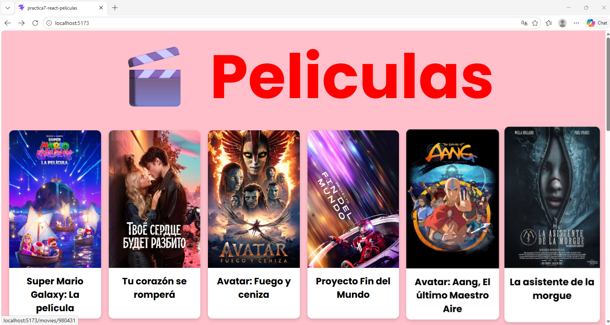
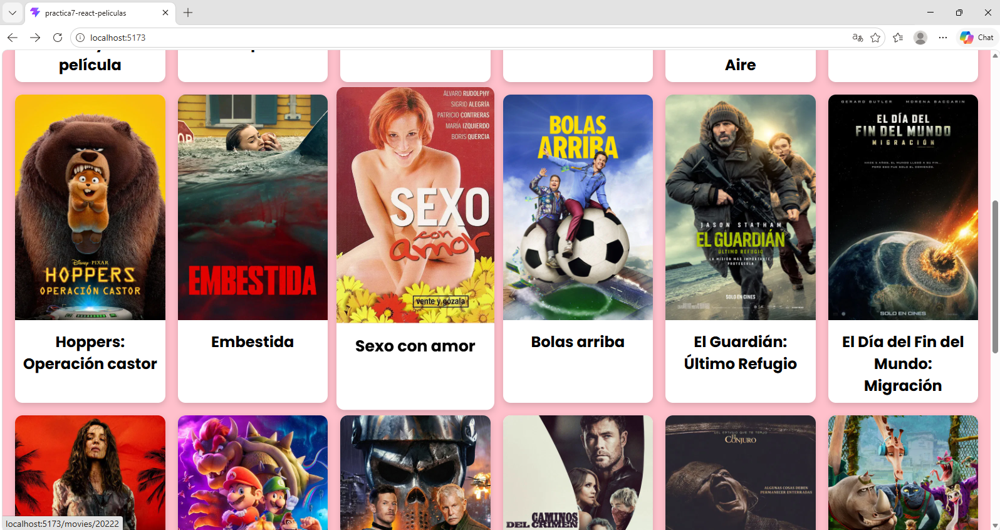
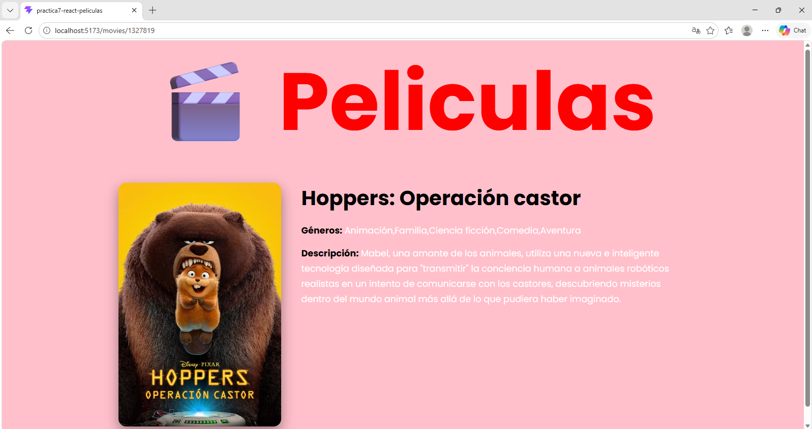

# React + Vite

This template provides a minimal setup to get React working in Vite with HMR and some ESLint rules.

Currently, two official plugins are available:

- [@vitejs/plugin-react](https://github.com/vitejs/vite-plugin-react/blob/main/packages/plugin-react) uses [Oxc](https://oxc.rs)
- [@vitejs/plugin-react-swc](https://github.com/vitejs/vite-plugin-react/blob/main/packages/plugin-react-swc) uses [SWC](https://swc.rs/)

## React Compiler

The React Compiler is not enabled on this template because of its impact on dev & build performances. To add it, see [this documentation](https://react.dev/learn/react-compiler/installation).

## Expanding the ESLint configuration

If you are developing a production application, we recommend using TypeScript with type-aware lint rules enabled. Check out the [TS template](https://github.com/vitejs/vite/tree/main/packages/create-vite/template-react-ts) for information on how to integrate TypeScript and [`typescript-eslint`](https://typescript-eslint.io) in your project.

# 🎬 Práctica 7 - Aplicación Web de Películas

## Integrantes

- Arenas Ríos Victor Abraham
- Bautista Bautista Jose Alberto
- Corona Becerra Luis Alfonso

## Descripción

Aplicación web desarrollada con React y Vite que consume la API de TMDB para mostrar un catálogo de películas populares y permitir visualizar el detalle de cada película.

## Objetivo

Aplicar conocimientos de React, componentes, rutas, consumo de APIs externas, control de versiones con GitHub y despliegue en Netlify.

## Tecnologías utilizadas

- React
- Vite
- React Router DOM
- CSS3
- JavaScript
- Git
- GitHub
- Netlify
- TMDB API

## Estructura del proyecto

src/
├── components/
├── pages/
├── routers/
├── services/
├── utils/
├── img/

## Instalación local

```bash
npm install
npm run dev

## Rutas
/ → Página principal con películas
/movies/:movieId → Detalle de película

## API utilizada

TMDB (The Movie Database)

## Funcionalidades
Mostrar listado de películas
Mostrar poster y título
Ver detalle de película
Navegación SPA con React Router
Diseño responsive

## Enlaces
Repositorio GitHun:
Proyecto en Netlify: 

## Evidencias






## conclusion
